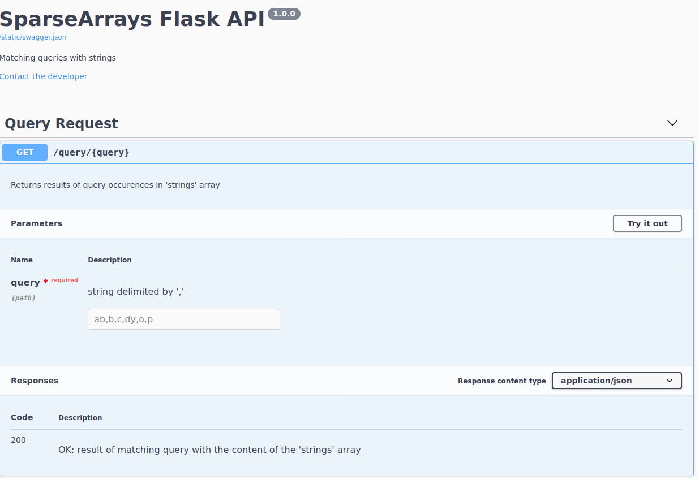
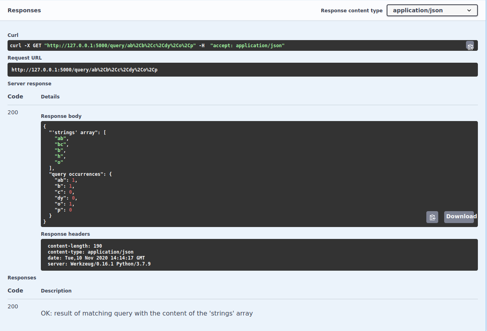

# Technical test MDM

## Technical Test with Python

The goal of the exercise is to resolve the following problem:
https://www.hackerrank.com/challenges/sparse-
arrays/problem

### Environment

- Python
- Pytest library
- Docker

### Description of the code

The code is comprised of the following classes:

```
├── Dockerfile
├── images
│   ├── swagger_ui_1.png
│   └── swagger_ui_2.png
├── main.py
├── README.md
├── requirements.txt
├── static
│   └── swagger.json
├── test.py
└── util
    ├── RandomArrayGenerator.py
    └── SparseArray.py
```
- Dockerfile: Commands to assemble a docker image of the application
- requirements.txt: requirements/dependencies to be installed when building image with docker
- images: folder containing pictures used in this Readme.md file
- static/swagger.json: JSON file read by Swagger containing a description of the API
- main.py: main program launching a Flask API with Swagger UI (see below section to know how to run it)
- test.py: test class (see the **Tests** section below for more details on how to run it)
- util/RandomArrayGenerator.py: Class that generates a random string array (used to generate the `strings` array)
- util/SparseArray.py: Class containing the function that determines the number of query occurences 
(from the `queries` array) in the `strings` array

### Run the program

#### Run the program locally

First, you have to be located in the project folder:

```bash
cd technical-test-mdm
```

In order to run the code, run the following command:

```bash
export FLASK_APP=main.py
python -m main
```

This instruction launches the Flask main application (Execute `CNTRL + C` to exit)
You can access the swagger UI at the following address: 
        
       0.0.0.0:5000/swagger (or 127.0.0.1:5000/swagger)
       


Click on **Try it out** to modify the `query` field and on **Execute** to retrieve the result:



As you can see from the above image, the result is displayed in a JSON of two attributes:
- First attribute: `'strings' array`
- Second attribute: `'strings' array`
       
As indicated in the above section, the `strings` array is randomly generated when you execute the program locally. 
The result will be displayed in a JSON as shown in the below example:

```
{a: 2, bc: 1, de: 0, f: 0} 
# queries array: [a, bc, de, f]
```

##### Query the Flask app without swagger

You can also query the Flask app by running below command:

```bash
curl http://127.0.0.1:5000/query/QUERY_VALUES
```

Where QUERY_VALUES represent all the values of the `query` array.  
For instance, `QUERY_VALUES`= a,bc,de,f  (Hence `query` = ['a', 'bc', 'de', 'f'])

e.g:

```bash
curl http://127.0.0.1:5000/query/a,b,d,r,o,p,ab
```

**Curl response:**

```json
{
  "'strings' array": [
    "l", 
    "cm", 
    "ck"
  ], 
  "query occurrences": {
    "a": 0, 
    "ab": 0, 
    "b": 0, 
    "d": 0, 
    "o": 0, 
    "p": 0, 
    "r": 0
  }
}
```

#### Run the program with Docker

Make sure you have docker installed: https://docs.docker.com/

Then run below commands from the root of the project to build the Docker image from the Dockerfile and run it:

```bash
docker build . -t test_mdm
docker run --name sparse-arrays-flask-app -t test_mdm
```

- `test_mdm`: name of the Docker image
- `sparse-arrays-flask-app`: name of the Docker container

The Flask app should be running.   
Follow then the same instructions as above to query the API from swagger.

You can also follow the section ***Query the Flask app without swagger*** 
by running the `curl` command inside the created container:

```bash
docker exec -it sparse-arrays-flask-app bash   
# Current directory should be /app
```

***Note 1:*** Contrary to the section ***Run the program locally***, the 'STRINGS_ARRAY' environment variable is already defined in the Dockerfile.
Hence, if you wish to modify the 'strings' array, modify this environment variable in the Dockerfile, rebuild the image and then run it.

***Note 2:*** You may have to precede those commands using `sudo` if you are not the user root 
or if your user doesn't belong to the `docker` group.

### Tests

#### Description

If you wish to see the existing tests, or to add more tests got to the `test.py` class.
We are using the `unittest` library.

To add a test, create a function test_[PURPOSE_OF_THE_TEST] where `PURPOSE_OF_THE_TEST` describes the type of test you realise. 

#### Run the tests

To run the tests using the ``pytest module, launch below command:

```bash
python -m pytest test.py
```

### Improvements
- Add more comments and description to the `swagger.json` file
- Add more tests to handle the `query` argument and the query endpoint
- Assign a random environment variable for **STRINGS_ARRAY**